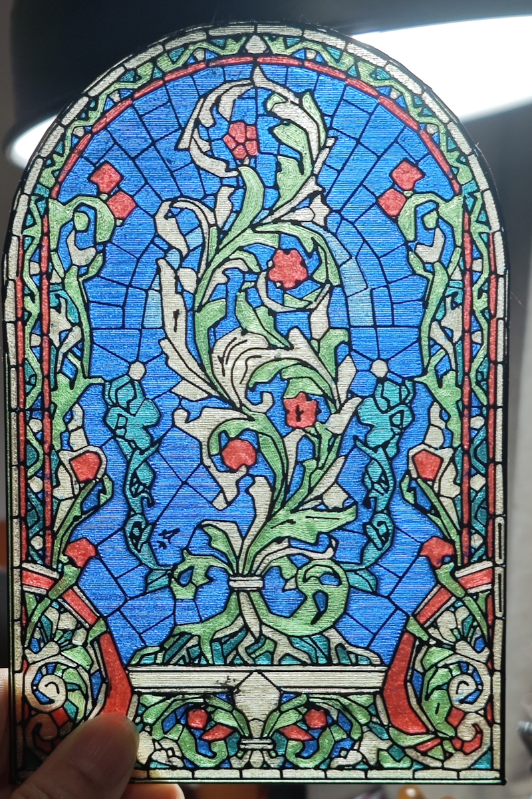
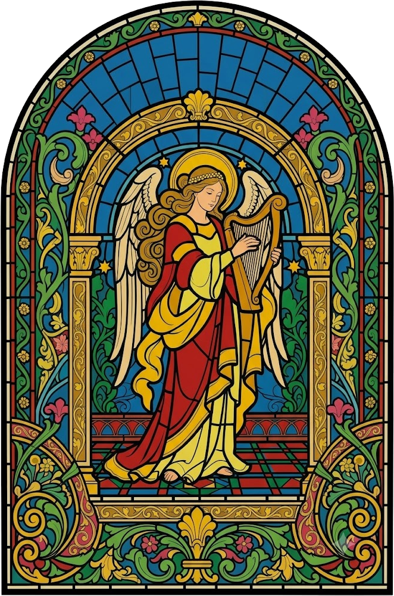
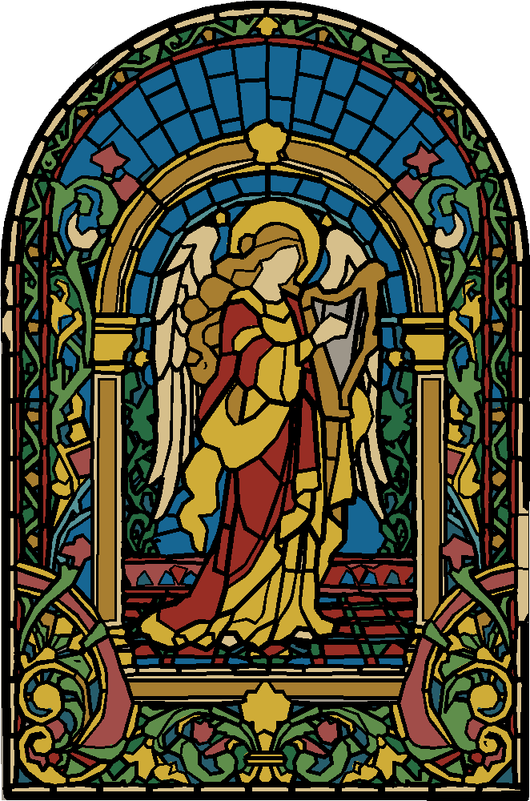
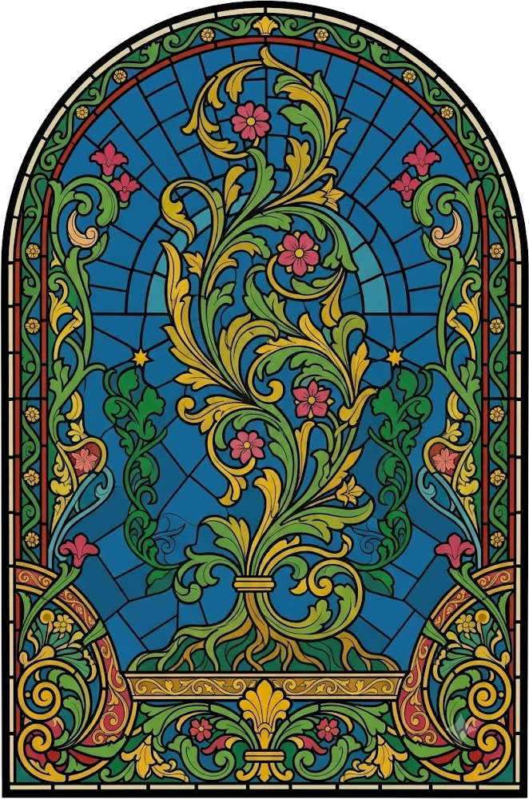
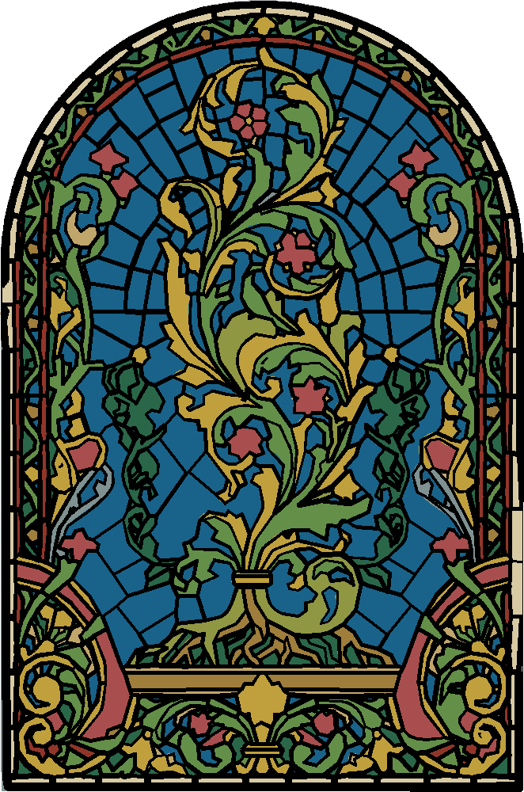

# PNG → 3D-printed Stained Glass

**English** | [简体中文](读我.md)

Turn any image into a **3D-printed stained-glass panel**: solid-colour glass
panes bounded by black leading (came), printed in **transparent filament** so it
glows when backlit. The output is deliberately **flat, per-pane shading** (no
gradients) — a filament printer can't reproduce photographic detail, so the image
is segmented into solid panes, exactly like real stained glass.

The repo is an end-to-end pipeline in three stages, each usable on its own:

1. **Vectorise** — `png_to_stained_glass_svg.py` splits the image into an exact
   planar partition of glass panes + the leading lines (this README).
2. **Calibrate** — measure each transparent filament's real backlit colour and
   build a printable-colour LUT + gamut ([`filament/`](filament/README.md)); you
   can **export the reachable colours** (`.gpl`/`.aco`) and paint your art in a
   palette that will actually print.
3. **Assemble** — `svg_to_3mf.py` snaps every pane to its nearest printable
   filament recipe and writes **one Bambu *Color Mixing* 3MF**, optionally with
   the leading embedded on top as an editable SVG part.

### Browser GUIs (the easy path)

Two local, dependency-light web apps wrap the whole thing — bilingual (EN + 简体中文),
each shows the underlying CLI command plus live previews:

```bash
python3 glass_gui.py       # image → panes → printable 3MF   → http://127.0.0.1:8010
python3 filament_gui.py    # calibrate filaments → LUT/gamut  → http://127.0.0.1:8000
```

## 3D-printed result

`sample2` printed and held to the light — the black leading and translucent
color panes come through just like real stained glass:

<p align="center">
  
</p>

## Examples

Generated with `python3 scripts/png_to_stained_glass_svg.py <input>.png --preview`.
Click any image to view it at full resolution.

### Sample 1

<p align="center">
  
  
</p>

### Sample 2

<p align="center">
  
  
</p>

---

## What it produces

Everything lands in a single folder, `<input>_fragments/` (override with
`--fragments-dir`):

| File | What it is |
|------|------------|
| `<name>_silhouette.svg` | Outer outline of the piece (+ interior holes), one even-odd path. |
| `<name>_leading.svg`    | The black came lines — stroked at real mm widths. Print this as the **black layer**. |
| `<name>_fragments.svg`  | All glass panes as one multicolor SVG (exact planar partition). |
| `color_NN_<hex>.svg`    | **One SVG per glass color** — each is its own print layer. |
| `<name>_fragments.png`  | Raster preview of the colored panes. |
| `<name>_preview.png`    | Optional composite preview (`--preview`). |

Every SVG carries **physical millimeter units** and four corner **registration
marks**, so all the color layers and the leading layer align when imported into
your slicer / print app (which typically crops to visible content and ignores
SVG page size and fill color — hence the marks and one-file-per-color).

---

## From panes to a printable 3MF

The `color_NN_<hex>.svg` panes above are *design* colours. To actually print them
in **transparent filament**, each pane's colour is matched to the nearest colour
a real backlit print can hit — a single filament, or a 2–3 filament Bambu
sub-layer mix — then the panes are extruded and assembled into **one Bambu 3MF**:

```bash
# after calibrating your filaments (see filament/README.md):
python3 scripts/svg_to_3mf.py --frag-dir myimage_fragments \
    --cal-root filament/calibration --out panel.3mf \
    --leading myimage_leading.svg          # embed the came on top (optional)
```

- Every pane becomes a part tagged with its printable recipe (single filament or a
  sub-layer colour-mix ratio); it opens as a genuine Bambu *Color Mixing* project.
- `--leading` embeds the came as a **raised, editable SVG part** sitting on the
  seams (Bambu's `BambuStudioShape`), so the black lines print on top of the glass.
- The colour matching, calibration, and gamut are all in
  **[`filament/`](filament/README.md)** — or just drive it from `glass_gui.py`.

---

## Why it's built this way

- **1 px = 0.4 mm** by default (a typical nozzle diameter). Max print size is
  clamped to 250 mm/side.
- **Extraction happens at full input resolution; only the vectors are scaled
  down** to fit the print bed. Downscaling the *raster* first would break thin
  black lines, so the geometry is extracted at full fidelity and the resulting
  vectors are scaled — thin lines stay continuous.
- **Fragments are an exact planar partition** (0 gaps, 0 overlaps): panes are
  built by tracing the shared pixel cracks between regions and re-fitting them
  once, so adjacent panes share the identical edge. Overlaps would be
  unprintable (which color wins?) and gaps would leave holes.
- **Leading and fragments come from the same geometry**, so the black came sits
  exactly on the pane seams.
- **The 3D-print app ignores SVG fill color**, so each color is emitted as its
  own file (= its own print layer / filament swap).

---

## Install

Python 3.9+ and a few scientific packages:

```bash
pip install pillow numpy scipy scikit-image opencv-python shapely
pip install rawpy            # optional: decode RAW (DNG/ARW/…) calibration photos
```

---

## Usage

```bash
python3 scripts/png_to_stained_glass_svg.py input.png [options]
```

### Examples

Basic (12 colors, auto tiered leading):

```bash
python3 scripts/png_to_stained_glass_svg.py portrait.png
```

A figure with a dark garment, 4 colors, exact came widths, smoother curves:

```bash
python3 scripts/png_to_stained_glass_svg.py figure.png \
    --num-colors 4 \
    --tier-thin 0.4 --tier-bold 0.8 \
    --black-block-mm 3 \
    --smooth-curves
```

Tune how black is split into thin *leading* vs solid black *glass*:

```bash
# Lower --black-block-mm so a thick region (e.g. a sleeve) becomes a solid
# black GLASS pane ringed by a bold came, instead of thin leading lines.
python3 scripts/png_to_stained_glass_svg.py photo.jpg --black-block-mm 3
```

---

## How it works (pipeline)

1. **Silhouette** — non-transparent pixels → outer contour + holes → one clean
   polygon (`clip_poly`), reused everywhere so all outlines register.
2. **Black split** — black pixels are split into thin **leading lines** and
   thick **blocks**. A thick block (a dark garment, a border) becomes a **black
   glass pane** ringed by a bold **came**, not a mess of thin lines.
3. **Color quantization** — area-weighted k-means into `--num-colors` groups;
   near-identical adjacent panes with no black between them are merged.
4. **Partition** — the label image's pixel cracks are traced into arcs, smoothed
   once, and rebuilt into faces with `shapely.polygonize` → exact shared-edge
   panes.
5. **Leading** — the leaded arcs are linked into continuous lines (so a curve
   broken by crossings keeps one consistent width), tiered into **thin vs bold**,
   and stroked. A perimeter **came** frames the whole piece.
6. **Emit** — all SVGs + PNGs, with registration marks, into the output folder.

---

## Options

### Sizing & I/O

| Option | Default | Description |
|--------|---------|-------------|
| `--fragments-dir DIR` | `<input>_fragments/` | Output folder for all files. |
| `--px-mm MM` | `0.4` | Physical size of one input pixel (nozzle width). |
| `--max-size-mm MM` | `250` | Clamp longest printed side to this; vectors scale to fit. |
| `--autocrop` / `--no-autocrop` | on | Trim transparent border before sizing. |
| `--preview` | off | Also write a composite preview PNG. |
| `--silhouette-fill none\|black` | `none` | Silhouette as an outline or a filled shape. |
| `--reg-mark-size MM` | `1.0` | Size of the corner registration marks. |

### Color & fragments

| Option | Default | Description |
|--------|---------|-------------|
| `--num-colors N` | `12` | Glass colors (k-means groups). Hard cap 24. |
| `--fragment-color original\|quantized` | `quantized` | Keep source colors or quantize. |
| `--segment-mode color\|leading` | `color` | Split panes by color+leading, or leading only. |
| `--min-fragment-area PX` | `32` | Merge panes smaller than this into a neighbor. |
| `--color-merge-tol N` | `110` | Merge touching same-ish colored panes (RGB distance; 0 = off). |
| `--lum-threshold N` | `90` | A pixel is "black/leading" if all of R,G,B are below this. |
| `--alpha-min N` | `128` | Alpha at/above which a pixel counts as opaque. |

### Leading (came) width

| Option | Default | Description |
|--------|---------|-------------|
| `--line-width tier\|auto\|MM` | `tier` | `tier` = two widths (bold outlines vs thin splitters); `auto` = each stroke's measured width; a number = fixed mm. |
| `--tier-thin MM` | auto | Force the exact **thin**-tier width (0 = auto from pixels). |
| `--tier-bold MM` | auto | Force the exact **bold**-tier width (0 = auto). |
| `--line-width-scale F` | `1.0` | Multiply all measured widths. |
| `--min-line-width PX` | `1.5` | Floor for leading width (1.5 px ≈ 0.6 mm). |
| `--perimeter-came` / `--no-perimeter-came` | on | Frame the whole piece with a came. |

### Line linking & smoothing

| Option | Default | Description |
|--------|---------|-------------|
| `--link-angle DEG` | `35` | At a junction, two arcs join into one continuous line only if their tangents are within this angle of straight (bigger = corner, chain stops). |
| `--link-width-ratio R` | `1.7` | Max width ratio to link two arcs as the same line. |
| `--smooth-curves` | off | Emit leading as smooth Bézier curves (rounds linked junctions). Best for sparse, curvy art; the default polyline is crisper on dense line-work. |

### Black blocks (solid black glass)

| Option | Default | Description |
|--------|---------|-------------|
| `--black-block-mm MM` | `3.0` | Black regions thicker than this become **black glass panes** (ringed by a bold came) instead of leading. `0` disables. |
| `--min-black-area PX` | `2` | Drop black specks smaller than this. |

### Geometry tolerances

| Option | Default | Description |
|--------|---------|-------------|
| `--fit-tolerance PX` | `0.4` | Bézier fit tolerance. |
| `--simplify-tolerance PX` | `0.3` | Contour pre-simplification. |
| `--smooth-tolerance PX` | `1.2` | Ring smoothing. |
| `--connectivity 4\|8` | `8` | Pixel connectivity for components. |

Run `python3 scripts/png_to_stained_glass_svg.py --help` for the complete list.

---

## Tuning tips

- **Thin lines that should be bold** — if a bold outline rings a dark region
  (a sleeve, a garment), lower `--black-block-mm` until that region is detected
  as one solid block: its outline is then drawn as a bold came instead of a thin
  seam.
- **Jagged / faceted curves** — the arc *linking* already gives long lines a
  consistent width; add `--smooth-curves` only for sparse, very curvy art. On
  dense line-work the plain polyline usually looks cleaner.
- **Exact came widths** — set `--line-width tier` with `--tier-thin` /
  `--tier-bold` in mm.
- **Missing / doubled dividers** — adjust `--color-merge-tol` (merges
  near-identical color bands) and `--min-fragment-area` (removes slivers).
- **Too many / too few colors** — `--num-colors` (cap 24). Fewer colors = fewer
  filament swaps.

---

## Printing notes

- **Easiest:** build **one Bambu colour-mix 3MF** from the panes (see
  [From panes to a printable 3MF](#from-panes-to-a-printable-3mf) /
  `glass_gui.py`) — every pane's filament recipe and the leading come embedded.
- **Manual layers:** or import the raw SVGs yourself — the **`color_NN_*.svg`**
  files as separate colored layers and **`<name>_leading.svg`** as the black layer
  on top. Keep the corner **registration marks** on every layer; they're how the
  layers stay aligned on import.
- Black leading is a separate layer/part, so black does **not** consume a color
  slot (except genuine black *glass* blocks).

---

## License

[GNU General Public License v3.0](LICENSE).
